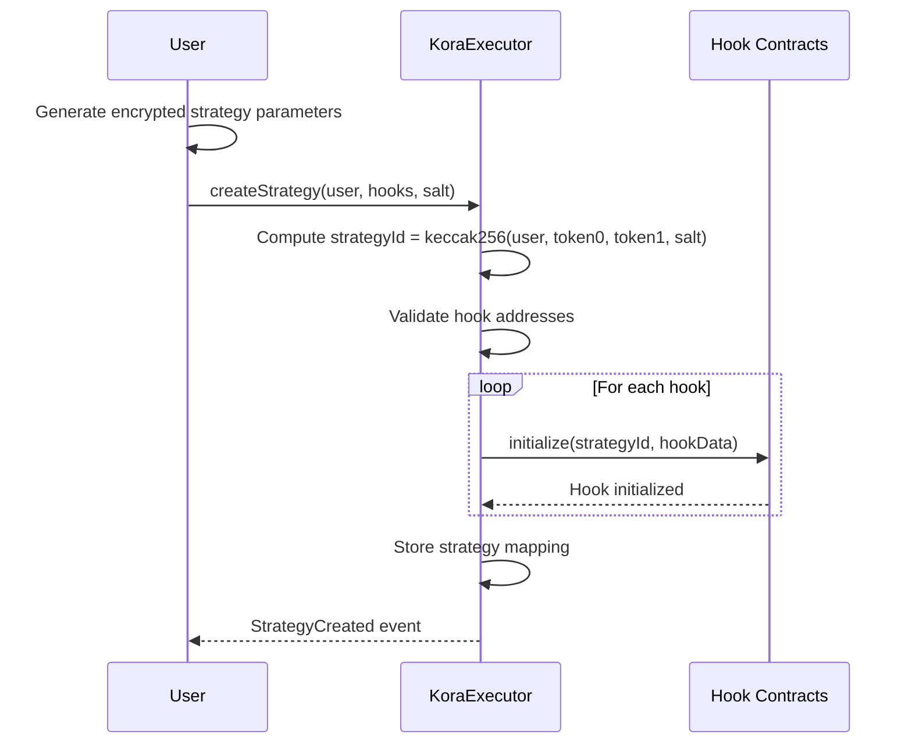
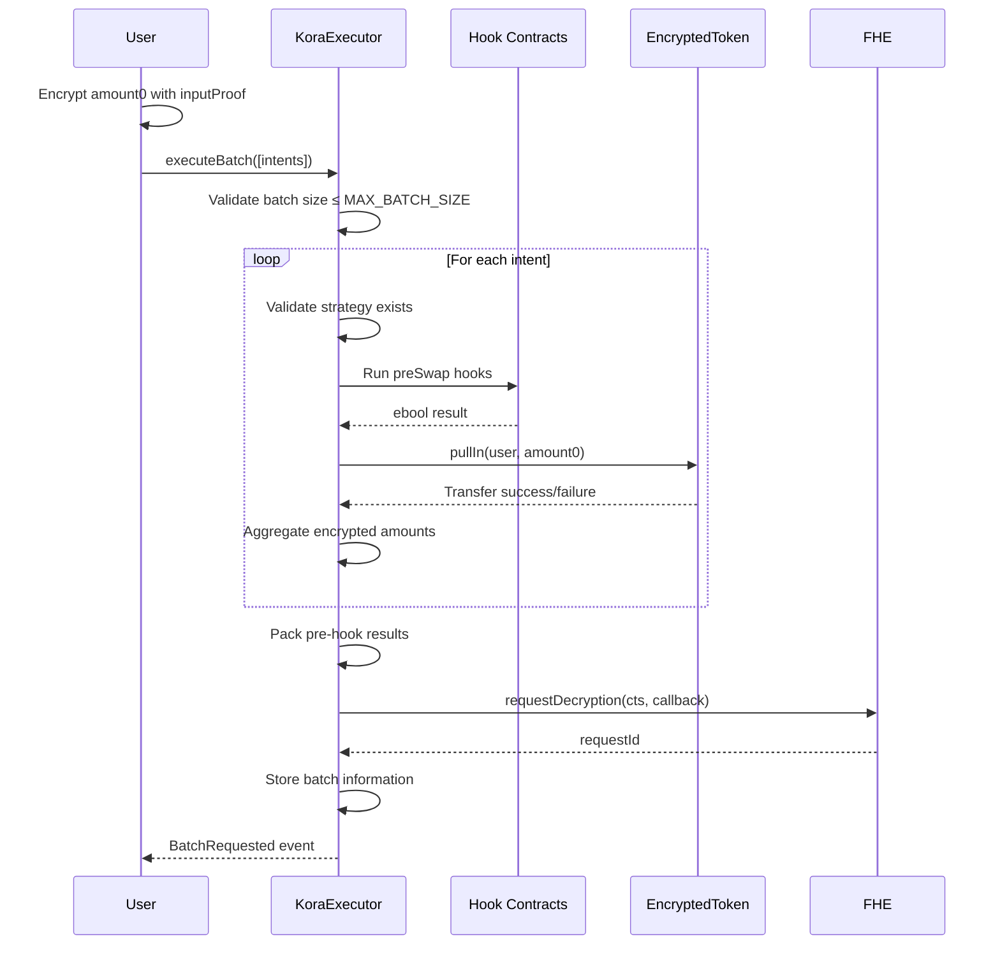
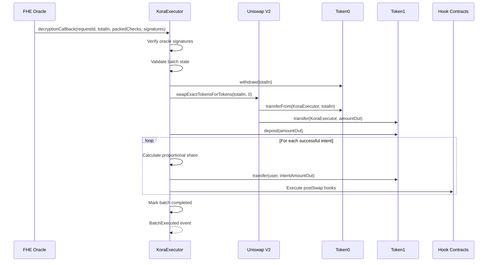

# Kora Protocol: Privacy-Preserving DCA Bot with Transaction Batching

## Table of Contents
1. [Overview](#overview)
2. [Architecture](#architecture)
3. [WorkFlow](#workflow)
4. [Hook System Architecture](#hook-system-architecture)
5. [Deployments](#deployments)
6. [Testing](#testing)
7. [Future Enhancements](#future-enhancements)

## Overview

Kora is a privacy-preserving Dollar Cost Averaging (DCA) bot that leverages Fully Homomorphic Encryption (FHE) and the Zama Confidential Blockchain Protocol to execute automated investment strategies while maintaining complete user privacy. The protocol aggregates encrypted DCA intents from multiple users, executes batched swaps on decentralized exchanges, and distributes purchased tokens proportionally without revealing individual investment amounts or strategies.

### Key Features
- **Privacy-Preserving**: All user parameters and amounts remain encrypted throughout the entire process
- **Batched Execution**: Aggregates multiple user intents into single transactions for gas efficiency
- **Hook-Based Strategy System**: Modular, extensible strategy framework with customizable conditions
- **FHE Integration**: Leverages Zama's FHE implementation for encrypted computations
- **Automated DCA**: Executes strategies based on time, frequency, and dynamic market conditions

## Architecture

The protocol is built on Zama's Confidential Blockchain using Fully Homomorphic Encryption (FHE) to enable private computations on encrypted data. The system comprises four main components:

- **KoraExecutor**: The central smart contract that orchestrates strategy management, batch processing, and swap execution. It handles encrypted operations through FHEVM library integration and manages the complete workflow from intent collection to token distribution.
- **Encrypted ERC20 Tokens**: Privacy-preserving token implementations that extend standard ERC20 functionality with FHE capabilities. These tokens (e.g., eWETH, eUSDC) maintain encrypted balances and support encrypted transfers while interfacing with underlying standard tokens for DEX interactions.
- **Hook System**: Modular conditional validators that enforce strategy parameters without revealing them. Each hook implements a specific validation rule through standardized interfaces, allowing strategy composition without modifying the core protocol.

### Technical Implementation Details

#### Strategy Management

Users create strategies by combining multiple hooks with encrypted parameters. Each strategy receives a unique identifier computed as `keccak256(user, token0, token1, salt)`, ensuring deterministic addressing while preserving privacy. Strategies store only public addresses and encrypted state, with all sensitive data maintained within hooks.

#### Batch Processing Mechanism

The system collects encrypted intents from multiple users and processes them in batches of up to 64 transactions. The batching operates through two-phase execution:

- Phase 1 - Encrypted Processing:
    - Validates intents against strategy hooks using FHE operations
    - Aggregates encrypted swap amounts using homomorphic addition
    - Packages pre-hook results into packed boolean arrays for efficient decryption
- Phase 2 - Decrypted Execution:
    - Receives decrypted totals from FHE oracle after signature verification
    - Executes single aggregated swap on Uniswap V2
    - Calculates proportional distributions using encrypted arithmetic
    - Distributes output tokens back to users based on their contribution percentages

#### Hook Architecture

Hooks implement the ISwapHook interface with three functions:

- `initialize()`: Sets up encrypted strategy parameters
- `preSwap()`: Validates intents against strategy rules using FHE comparisons
- `postSwap()`: Updates encrypted state after successful executions

Standard hooks include:

1. `BudgetHook`: Enforces maximum total expenditure with FHE.le(spent + amount, budget)
2. `PurchaseAmountHook`: Validates per-transaction limits
3. `TimeframeHook`: Checks timestamp validity using encrypted time comparisons
4. `FrequencyHook`: Ensures minimum intervals between executions

## Workflow

### Strategy Creation Phase



Users create customized DCA strategies by specifying encrypted parameters through hook contracts:

- `BudgetHook`: Sets maximum total spendable amount
- `PurchaseAmountHook`: Defines maximum per-transaction amount
- `TimeframeHook`: Sets strategy expiration time
- `FrequencyHook`: Controls execution intervals
- `DynamicConditionHook`: Optional conditions like "buy the dip"

Each strategy receives a unique strategyId computed as `keccak256(user, token0, token1, salt)`, ensuring deterministic addressing.

### Intent Submission and Batching



Users submit encrypted trading intents containing:

- amount0: Encrypted amount of token0 to swap
- inputProof: Zero-knowledge proof of valid encryption
- intentId: Unique identifier for the intent
- strategyId: Reference to user's strategy

The batch mechanism:

1. Collects up to 64 intents (MAX_BATCH_SIZE)
2. Validates each against strategy hooks
3. Aggregates encrypted amounts using FHE operations
4. Packages hooks results (`ebools`) into single packed `euint64` for single decryption
5. Requests decryption from FHE oracle

### Batch Execution Phase



Upon receiving decrypted values from the FHE oracle:

1. **Signature Verification**: Validates oracle responses
2. **Token Preparation**: Withdraws underlying tokens for swapping
3. **DEX Execution**: Executes single aggregated swap on Uniswap V2
4. **Proportional Distribution**: Calculates and distributes output tokens using encrypted arithmetic
5. **Post-Hook Execution**: Runs strategy completion hooks

## Hook System Architecture

### Hook Interface

```solidity
interface ISwapHook {
    function initialize(bytes32 strategyId, bytes memory data) external;
    function preSwap(bytes32 strategyId, Intent calldata intent) external returns (ebool);
    function postSwap(bytes32 strategyId, IntentResult memory result) external;
}
```

#### Hook Types

**Budget Hook (`BudgetHook.sol`)**
- Manages total investment budget
- Tracks remaining allocation
- Prevents over-investment

**Frequency Hook (`FrequencyHook.sol`)**
- Controls purchase timing
- Manages interval-based execution
- Prevents too-frequent purchases

**Purchase Amount Hook (`PurchaseAmountHook.sol`)**
- Manages per-interval amounts
- Implements dynamic amount adjustments
- Handles market condition responses

**Timeframe Hook (`TimeframeHook.sol`)**
- Controls strategy duration
- Manages start/end dates
- Implements time-based constraints

## Deployments

Kora has been deployed on Ethereum Sepolia Testnet.

  <!-- const usdcAddress = "0x2d83Fff32862A6FBB7518DBfEa113979B8631797";
  const wethAddress = "0x0C013Aa8CfE54Af1D892759fBc35F8835Ad163F7";
  const eUSDCAddress = "0xCe4Fd687fa2EFE9a04d8745753C9E364DF91De1E";
  const eWETHAddress = "0xE6184Bb67cd3B797C7e36DC460c83a7A5AB87063";
  const budgetHookAddress = "0x1A34059f5015362fBa4255B9ef30e884a7B142E4";
  const purchaseAmountHookAddress =
    "0xC92e075c52F2Fe38d6389aC2b39bEE5788C341c2";
  const timeframeHookAddress = "0x9dc301778C7EE60E30C7F8F89814bC5b7b3c4F41";
  const frequencyHookAddress = "0xD7e7a322EaADA366C718e487FD3f2255a95C092f";
  const koraExecutorAddress = "0xc82Fa85409D50De86396dCb57C08506522C33991";
  const deployerAddress = "0x9A36a8EDAF9605F7D4dDC72F4D81463fb6f841d8"; -->

| Contract | Address |
| --- | --- |
| KoraExecutor | [0xc82Fa85409D50De86396dCb57C08506522C33991](https://sepolia.etherscan.io/address/0xc82Fa85409D50De86396dCb57C08506522C33991) |
| USDC |[0x2d83Fff32862A6FBB7518DBfEa113979B8631797](https://sepolia.etherscan.io/address/0x2d83Fff32862A6FBB7518DBfEa113979B8631797)  |
| WETH | [0x0C013Aa8CfE54Af1D892759fBc35F8835Ad163F7](https://sepolia.etherscan.io/address/0x0C013Aa8CfE54Af1D892759fBc35F8835Ad163F7) |
| eUSDC | [0xCe4Fd687fa2EFE9a04d8745753C9E364DF91De1E](https://sepolia.etherscan.io/address/0xCe4Fd687fa2EFE9a04d8745753C9E364DF91De1E) |
| eWETH | [0xE6184Bb67cd3B797C7e36DC460c83a7A5AB87063](https://sepolia.etherscan.io/address/0xE6184Bb67cd3B797C7e36DC460c83a7A5AB87063) |
| BudgetHook | [0x1A34059f5015362fBa4255B9ef30e884a7B142E4](https://sepolia.etherscan.io/address/0x1A34059f5015362fBa4255B9ef30e884a7B142E4) |
| PurchaseAmountHook | [0xC92e075c52F2Fe38d6389aC2b39bEE5788C341c2](https://sepolia.etherscan.io/address/0xC92e075c52F2Fe38d6389aC2b39bEE5788C341c2) |
| TimeframeHook | [0x9dc301778C7EE60E30C7F8F89814bC5b7b3c4F41](https://sepolia.etherscan.io/address/0x9dc301778C7EE60E30C7F8F89814bC5b7b3c4F41) |
| FrequencyHook | [0xD7e7a322EaADA366C718e487FD3f2255a95C092f](https://sepolia.etherscan.io/address/0xD7e7a322EaADA366C718e487FD3f2255a95C092f) |

## Testing

### 1. Test Structure

The test suite is organized into logical modules located in `packages/contracts/test`:

```
test/
├── executor.test.ts          # Main contract integration tests
├── helpers/
│   ├── env.ts               # Test environment setup
│   ├── index.ts             # Common test utilities
│   └── uniswap.ts           # Uniswap integration tests
├── libraries/
│   └── packed-bool.test.ts  # Library unit tests
└── wrapped-token.test.ts    # Token contract tests
```

### 2. Test Coverage

#### Integration Tests (`executor.test.ts`)
- **Strategy Creation**: Test strategy creation and validation
- **Intent Processing**: Test intent submission and validation
- **Batch Execution**: Test batch formation and execution
- **Hook Integration**: Test pre and post-swap hook execution
- **Token Distribution**: Test proportional token distribution

#### Unit Tests
- **Library Tests**: Test utility libraries and helper functions
- **Token Tests**: Test encrypted token functionality
- **Hook Tests**: Test individual hook implementations

#### Helper Functions
- **Environment Setup**: Configure test environment and contracts
- **Uniswap Integration**: Mock DEX operations for testing
- **Test Utilities**: Common testing functions and assertions

## Future Enhancements

- **Larger Batch Sizes**: Implementation of dynamic batch sizing algorithms that automatically adjust based on network congestion and gas prices. 
- **Advanced Hook Types**: Development of more sophisticated hook patterns including:
    - Oracle-Based Hooks: Integration with price oracles for conditional execution based on external market data
    - Social Hooks: Strategy templates that can be shared and executed with parameter customization
    - Cross-Strategy Hooks: Coordination between multiple strategies for complex portfolio rebalancing
- **Intent Matching Engine**: Development of an off-chain intent matching system that optimizes batch composition based on strategy compatibility, reducing on-chain computation requirements.
